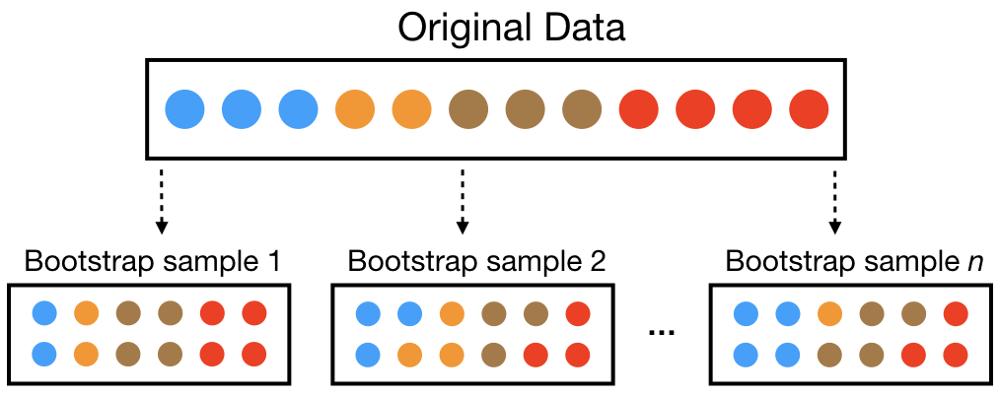
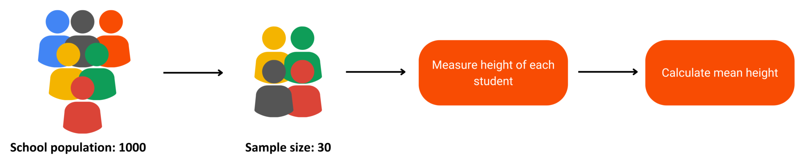
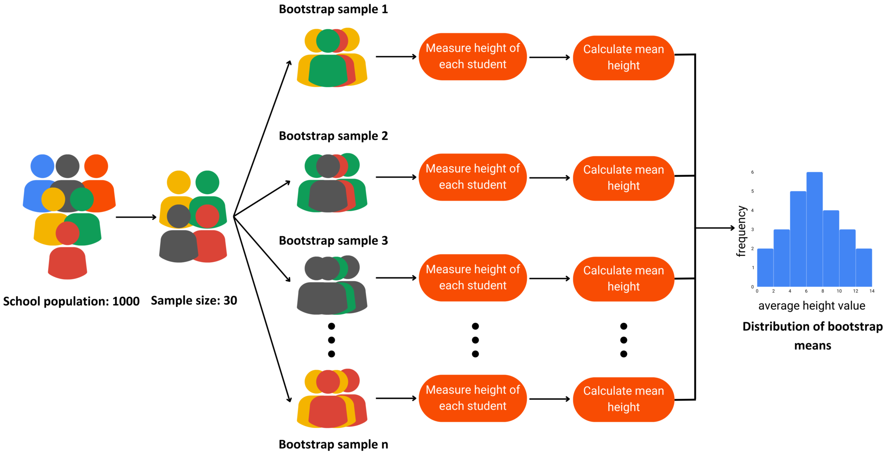

# Bootstrap Sampling

- Reference:
  - [Understanding Bootstrap Sampling: A Guide for Data Enthusiasts](https://datasciencedojo.com/blog/bootstrap-sampling/)

## Intuition

- In the world of data analysis, drawing insights from a limited dataset can often be challenging.
- Traditional statistical methods sometimes fall short when it comes to deriving reliable estimates, especially with small or skewed datasets.
- This is where bootstrap sampling, a powerful and versatile statistical technique, comes into play.

## What is Bootstrap Sampling (Sampling with Replacement) ?

- **Bootstrap sampling** (Sampling with Replacement) is a resampling method that involves repeatedly drawing samples from a dataset with replacements to estimate the sampling distribution of a statistic.

## Why do we Need Bootstrap Sampling?

- **Traditional method** to sampling a distribution:
  - Step 1: Draw a random sample of 30 students from the school.
  - Step 2: Measure the heights of these 30 students.
  - Step 3: Compute the mean height of this sample.
  - **Limitation**: the mean height calculated from this _single sample_ might not be a reliable estimate of the population mean due to sampling variability. If we draw a different sample of 30 students, we might get a different mean height.

- **Boostrap Approach**:
  - Step 1: Draw a random sample of 30 students from the school and measure their heights. This is your original sample.
  - Step 2: From this original sample, create many new samples (bootstrap samples) by randomly selecting students with replacements. For instance, generate 1,000 bootstrap samples.
  - Step 3: For each bootstrap sample, calculate the mean height.
  - Step 4: Use the distribution of these 1,000 bootstrap means to estimate the mean height of the population and to assess the variability of your estimate.
  

