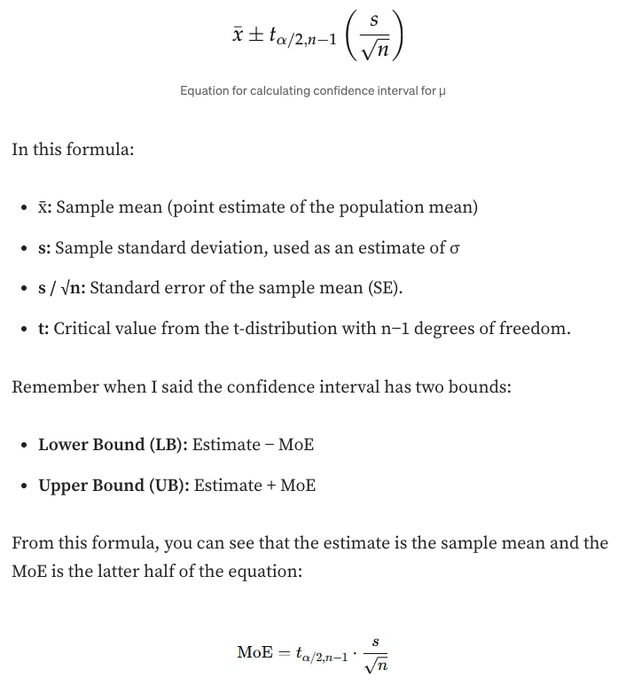

# Confidence Intervals

- Reference: [Confidence Intervals: Estimating Population Parameters Made Simple](https://medium.com/@sahn1998/confidence-intervals-estimating-population-parameters-with-precision-ee8f7fdfbecf)

## What is a Confidence Interval ?

- `Confidence intervals` are a crucial analytical method in statistics that help us _estimate the range of likely values_ a **population parameter** likely lies within, based on **sample** data.
- A confidence interval (CI) is a range of values that, with a certain level of confidence (e.g., 95%), is likely to contain the true population parameter.
- For example, when estimating a _population mean_, the _sample mean_ (the estimate) may not exactly match the true mean of the population.
  - A confidence interval helps express this uncertainty by showing the range within which the true population mean likely falls.

## Confidence Interval Forumla

- A CI is written in the format $(\text{Lower Bound}, \text{Upper Bound})$, and each bound are calculated with 2 components: an **Estimate** and a **Margin of Error** (usually denoted as **MoE**).
  - Lower Bound (LB): $Estimate − MoE$
  - Upper Bound (UB): $Estimate + MoE$

### What is an Estimate ?

- The `estimate` is the point value derived from your sample data that serves as an approximation of the population parameter.
  - Generally, the estimate is the sample mean, an estimate of what the population should look like based on sample data.

### What is a Margin of Error (MoE)?

The `Margin of Error (MoE)` accounts for **variability** and reflects how much the estimate (the sample mean) might differ from the true population parameter.

- The MoE depends on:
  - The **confidence level** (e.g., 95% or 99%).
  - The **standard error** (SE) of the estimate.
  - The **critical value** (e.g., Z-score or t-score) based on the confidence level.
- A generalized formula for the Margin of Error is:
  $$MoE=\text{Critical Value}*\text{Standard Error}$$

## Fundamental Types of Confidence Intervals

### Type 1: Estimating Population Mean ($\mu$)

- $\mu$ represents the **population mean**, which is the true average of a characteristic for the entire population.
- $\bar{X}$ represents the **sample mean**, which is the average calculated from a sample of the population and serves as an estimate of the population mean ($\mu$)

<p align="center"><br>Equation for calculating confidence interval for the population mean</p>

- Example: a small e-commerce company is currently measuring the app load time for a sample of `n = 25` users. We want a confidence interval of 95%. We found that,
  - Sample mean $\bar{X}=3$ seconds
  - Sample standard deviation $s = 0.5$ seconds
  - $\alpha=0.05$ (i.e. with a confidence interval of 95%)

```Python
from scipy.stats import t

# Parameters
alpha = 0.05         # Confidence level is 95%, so alpha = 1 - 0.95
df = 24              # Degrees of freedom (n - 1)
s=0.5
# Calculate the t-critical value
t_critical = t.ppf(1 - alpha / 2, df)

print(f"t-critical value: {t_critical}") # 2.064
moe = t_critical*(s/math.sqrt(n)) # 0.206
# CI: (3 - 0.206,3 + 0.206) =(2.794, 3.206)
```

- This means we are 95% confident that the true mean app load time lies between 2.794 seconds and 3.206 seconds.

### Type 2: Comparing Difference Between Means

- This is used when comparing the means of two independent groups, especially with unequal variances.
- The **resulting confidence interval** provides a range of values where the true difference between the population means likely lies, with a specified level of confidence (e.g., 95%).
  - If $\mu_1 − \mu_2 = 0$, it implies that there is no significant difference between the two population means.
    - In other words, the two groups are **statistically similar** with respect to the measured variable.

## CI Calculation

### Quantile Method

- Example 1:

```Python
# Calculate 95% confidence interval using quantile method
lower = np.quantile(late_shipments_boot_distn, 0.025)
upper = np.quantile(late_shipments_boot_distn, 0.975)

# Print the confidence interval
print((lower, upper))
```
