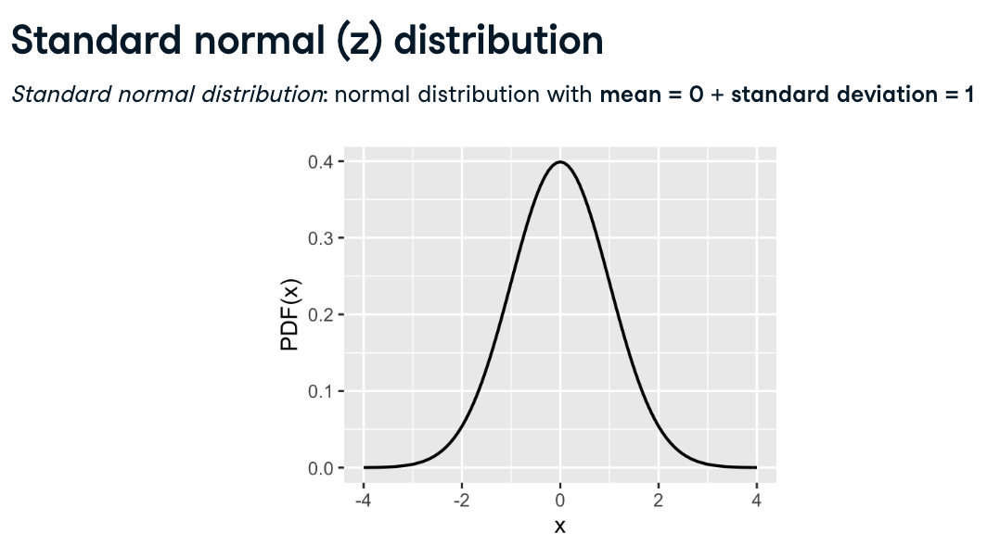
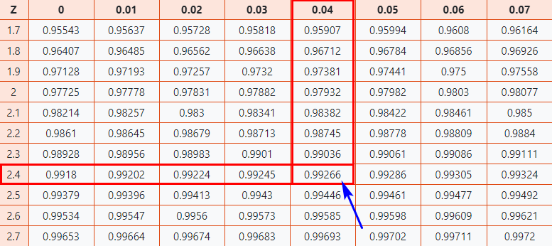
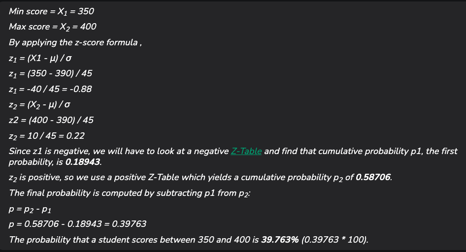

# Z-Score

## What is Z-Score?

- Z-score is a statistical measure that describes a value's position relative to the mean of a group of values.
- It is expressed in terms of standard deviations from the mean.
- The Z-score indicates how many standard deviations an element is from the mean.
  $$z = \frac{X-\mu}{\sigma}$$
- Where:
  - $z$: z-Score
  - $X$: Value of Element
  - $\mu$: Population Mean
  - $\sigma$: Population Standard Deviation
- For example, a Z-score of 2 indicates the value is 2 standard deviations away from the mean.

### Standard normal (z) distribution

<p align="center"></p>

### How to interpret Z- score

- **Z-Score = 0**: A Z-score of 0 indicates that the data point is exactly at the mean of the distribution
- **Positive Z-Score**: A positive Z-score indicates that the data point is above the mean.
  - For example, a Z-score of 1.5 means the data point is 1.5 standard deviations above the mean.
- **Negative Z-Score**: A negative Z-score indicates that the data point is below the mean.
  - For example, a Z-score of -2 means the data point is 2 standard deviations below the mean.

### Outlier Detection

- **Common Thresholds**:
  - **Z-Score > 2 or < -2**: Often considered unusual or significant, indicating the data point is more than 2 standard deviations away from the mean.
  - **Z-Score > 3 or < -3**: Typically considered an outlier, suggesting the data point is extremely far from the mean.

```Python
import numpy as np

def calculate_z_score(data):
  # Mean of the dataset
    mean = np.mean(data)
   # Standard Deviation of tha dataset
    std_dev = np.std(data)
   # Z-score of tha data points
    z_scores = (data - mean) / std_dev
    return z_scores

# Example dataset
dataset = [3,9, 23, 43,53, 4, 5,30, 35, 50, 70, 150, 6, 7, 8, 9, 10]
z_scores = calculate_z_score(dataset)
print('Z-Score :',z_scores)

# Data points which lies outside 3 standard deviatioms are outliers
# i.e outside range of99.73% values
outliers = [data_point for data_point, \
          z_score in zip(dataset, z_scores) if z_score > 3]
print(f'\nThe outliers in the dataset is {outliers}')
# Z-Score : [-0.7574907  -0.59097335 -0.20243286  0.35262498  0.6301539  -0.72973781
#  -0.70198492 -0.00816262  0.13060185  0.54689523  1.10195307  3.32218443
#  -0.67423202 -0.64647913 -0.61872624 -0.59097335 -0.56322046]
# The outliers in the dataset is [150]
```

## Examples

- **Example 1**: You take the GATE examination and score 500. The mean score for the GATE is 390 and the standard deviation is 45. How well did you score on the test compared to the average test taker
  - Raw score/observed value = X = 500
  - Mean score = μ = 390
  - Standard deviation = σ = 45
  - By applying the z-score formula, z = (500 - 390) / 45 = 110 / 45 = 2.44
  - This means that your z-score is 2.44, z-score = 2.44, which indicates that the data point is 2.44 standard deviations above the mean.
  - Since the Z-Score is positive 2.44, we will make use of the positive Z-Table. As a result, the cumulative probability associated with the Z-score is 0.99266.
  - Conclusion: have performed well than almost 99% of other test-takers.

<p align="center"></p>

- Example 2: What is the probability that a student scores between 350 and 400 (with a mean score μ of 390 and a standard deviation σ of 45)?

<p align="center"></p>
