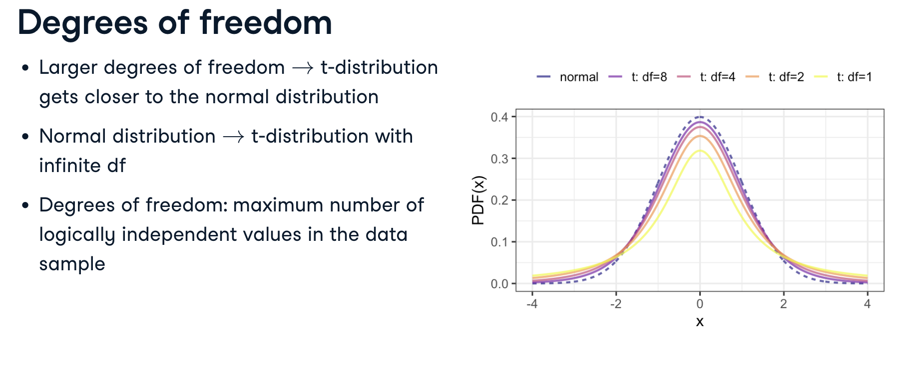
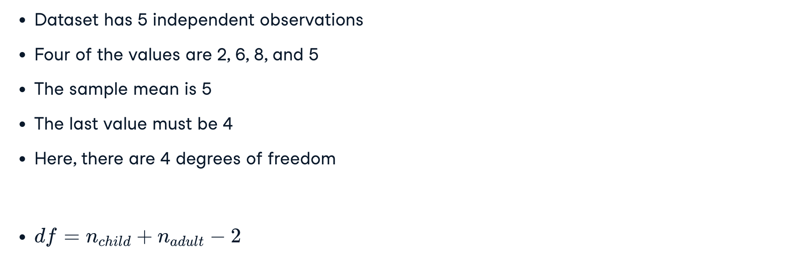
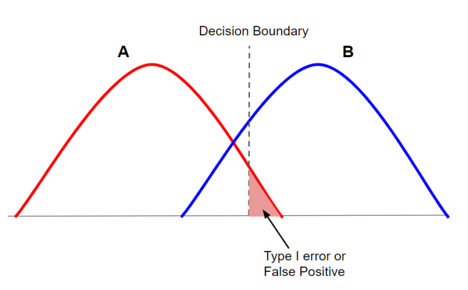
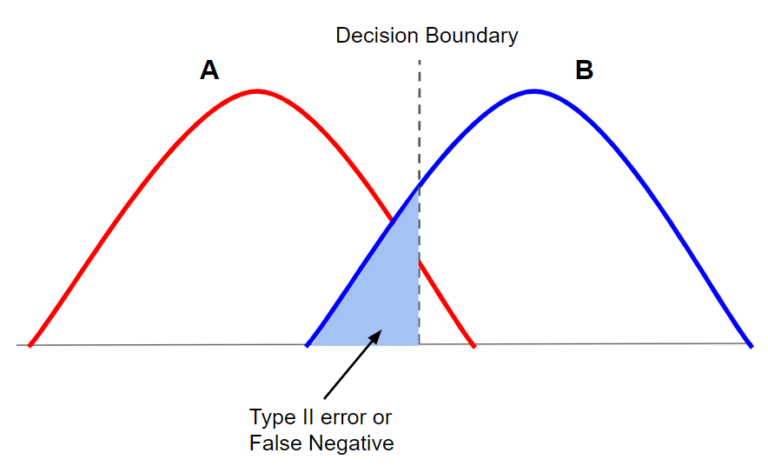

# Daily Knowledge

## Day 4

- **t-test** the data should be normally distributed
  - _One-sample t-test_ (determine if an unknown population mean does not equal a claimed value by taking a sample): `t_stat, p_val = stats.ttest_1samp(a=x, popmean = mu)`
  - _Two-sample t-test_ (test for differences in sample means between 2 groups) using t-tests & extend this to more than two groups using ANOVA & pairwise t-test
    - Normally distributed + equal variance: `t_stat, p_val = stats.ttest_ind(x, y)`
    - Normally distributed + not equal variance (Welch’s t-test): `t_stat, p_val = stats.ttest_ind(x, y, equal_var = False)`
  - _Paired t-test_: test for same group at different periods `t_stat, p_val = stats.ttest_rel(x,y)`
- Understanding the test results
  - The value of t-statistic comes out to be 4.69 which seems to be very far from the mean of zero in a t-distribution.
  - The p-value is less than the default significance level of 0.05, which indicates that the probability of such an extreme outcome is close to zero and that the null hypothesis can be rejected.

```Python
# t-statistic = 4.689539773390642
# p-value = 0.0001407967502139183
```

## Day 3

### t-distribution

- The test statistic, t, follows a t-distribution. t-distributions have a parameter called the **degrees of freedom**, or df for short.
- As we increase the degrees of freedom, the t-distribution gets closer to the normal distribution. In fact, a normal distribution is a t-distribution with infinite degrees of freedom.

<p align="center"></p>

#### DoF calculation

- Suppose our dataset has 5 independent observations, and that four of the values are 2, 6, 8, and 5. Suppose we also know the sample mean is 5. With this knowledge, the fifth value is no longer independent.
- In our two sample case, there are as many degrees of freedom as observations (number of childs $n_{child}$ + number of aldult $n_{adult}$), minus 2 because we know two sample statistics, the means for each group.

<p align="center"></p>

### z-score

What is Z-Score?

- Z-score is a statistical measure that describes a value's position relative to the mean of a group of values.
- It is expressed in terms of standard deviations from the mean.
- The Z-score indicates how many standard deviations an element is from the mean.
  $$z = \frac{X-\mu}{\sigma}$$
- Where:
  - $z$: z-Score
  - $X$: Value of Element
  - $\mu$: Population Mean
  - $\sigma$: Population Standard Deviation
- For example, a Z-score of 2 indicates the value is 2 standard deviations away from the mean.

### Boostrap Sampling

- **Bootstrap sampling** (Sampling with Replacement) is a resampling method that involves repeatedly drawing samples from a dataset with replacements to estimate the sampling distribution of a statistic.
- [Notebook](../notebooks/00-boostrap-sampling.ipynb)

<p align="center"></p>

## Day 2

### AB Testing Setup

#### Step 1: Sample Size Calculation

- Use a **power analysis** to determine the **minimum sample size** needed to detect a meaningful lift (e.g., 10% improvement in conversion rate).
  - Inputs:
    - **Baseline Conversion Rate** (Control Group A): 5% (0.05).
    - **Minimum Detectable Effect (MDE)**: The smallest improvement you want to detect (e.g., a 10% relative increase, which implies Treatment Group CR = 5 + 0.1\*5 = 5.5%)
      - Helps determine the sample size needed before running the test.
      - Ensures you don’t waste resources chasing tiny, irrelevant effects.
    - **Significance Level** ($\alpha$): 5% (standard, _two-tailed_ test unless you’re certain the model can’t perform worse i.e. use _one-tailed_).
      - 1-tailed or a 2-tailed test
    - **Statistical Power** ($1-\beta$): 80% (standard, meaning an 80% chance of detecting the MDE if it exists).
- **Significance Level** ($\alpha$): the probability of falsely rejecting the null hypothesis (Type I Error).
  - A **lower** $\alpha$ (e.g., 0.01) means stricter criteria to claim significance (reduces false positives but requires a **larger sample**).
  <p align="center"><br>Alpha value creates a decision boundary. Values that are on the right of the boundary will be considered part of distribution B and support the alternative hypothesis, those on the right of the boundary will be considered part of distribution A and support the null hypothesis.</p>
- **Statistical Power** ($1-\beta$): refer to the probability that your test will find a **statistically significant difference** when such a difference actually exists.
  - Power = 80% means there’s an 80% chance of detecting a 0.5% CR lift if it exists.
  - **Higher** power (e.g., 90%) reduces Type II Errors (false negatives) but requires **more data**.
  - In other words, Statisitcal Power = the probability that you will reject the null hypothesis when you should (and thus avoid a Type II error).
  <p align="center"><br>The shaded region represents beta. You can see how these are values that will be thought to be part of distribution A (support the null hypothesis) and thus have a negative test result. That is why they are considered a false negative. This type of testing error is called a type II error.</p>

#### Step 2: Statistical Analysis

- Statistical Significance: Reject H₀ if $p < 0.05$

##### Conversion Rate

- Use a **chi-squared** test or **z-test** for proportions:
  - Compare the proportion of voucher users in Group A vs. Group B.

```Python
from statsmodels.stats.proportion import proportions_ztest
count = [conversions_A, conversions_B]
nobs = [sample_size_A, sample_size_B]
z_stat, p_value = proportions_ztest(count, nobs, alternative='larger')
```

##### Average Spend

- Step 2.1: To check if the 2 distributions are normal
- Step 2.2: Use a Welch’s **t-test** (if data is normal) or **Mann-Whitney U** test (if skewed) to compare average spend per customer in Group A vs. Group B.

```Python
from scipy.stats import mannwhitneyu
stat, p_value = mannwhitneyu(spend_A, spend_B, alternative='greater')
```

## Day 1

- **Parametric** vs **Non-Parameteric**:
  - Parametric: `t-test`
  - Non-Parameteric: `Mann-Whitney U`
  - When to use ?
    - Normal data distribution and homogeneity of variances: Parametric tests
    - Otherwise: Non-parametric tests
- **Homogeneous** vs **Heterogeneous**:
  - **Heterogeneous** mixtures have visually distinguishable components
  - **Homogeneous**: mixtures appear uniform throughout.
    - Example 1: to check whether the variances are **homogeneous**, i.e. whether there is equality of variance.
- **Bootstrap** sample is taken from the original by using **sampling with replacement** (`replace=True`)

```python
sample_size=400

df.sample(n=sample_size, replace=True)
```

### AB Testing Assumption

- It is also important to ensure assumptions such as **data distribution** and **homogeneity** of **variances**.
- To test the normal distribution: use the **Shapiro-Wilk** test
- When these assumptions are met, parametric tests (e.g: t-test) can be used
- Otherwise: non-parametric tests (e.g Mann-Whitney U) are preferred.
