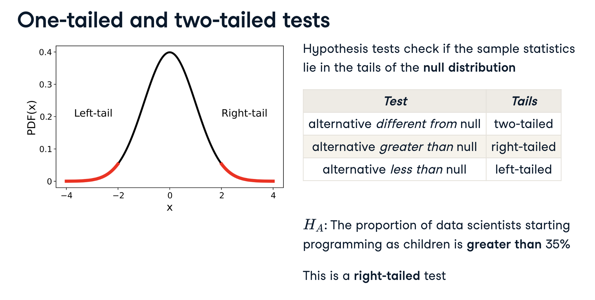
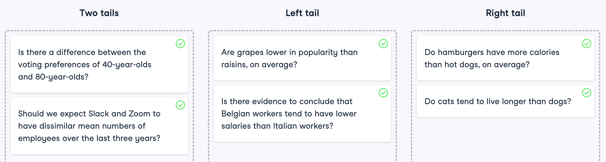
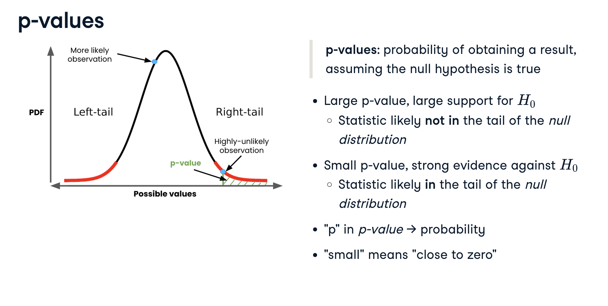
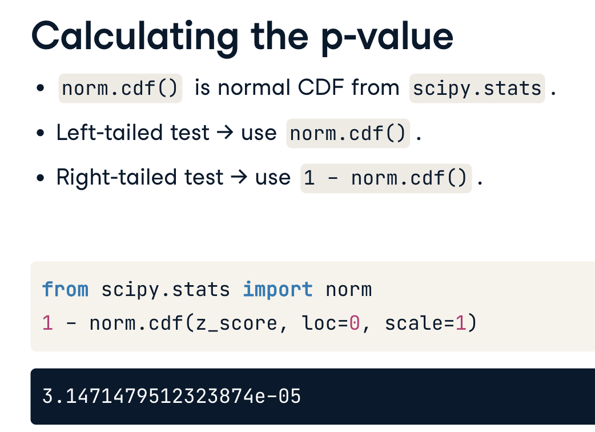
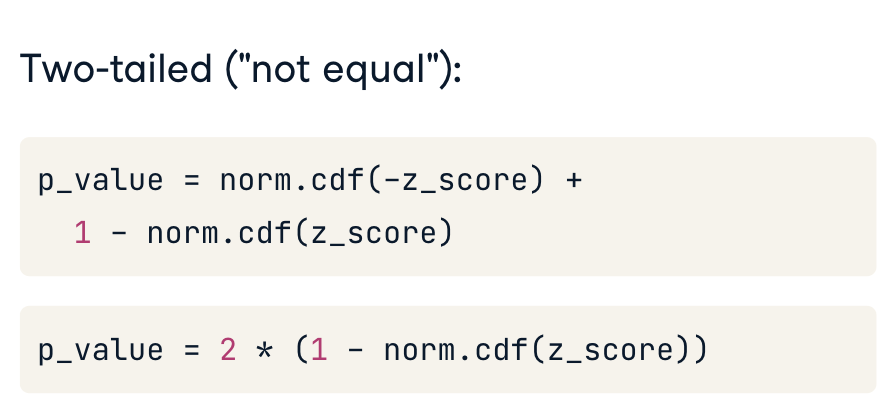
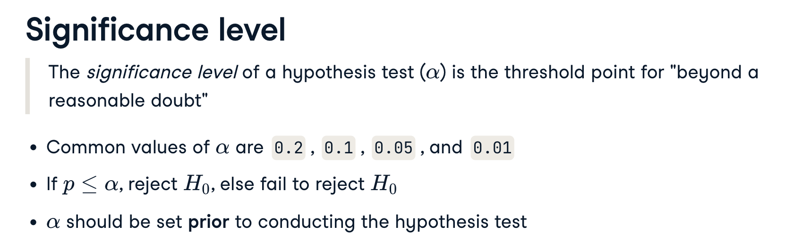
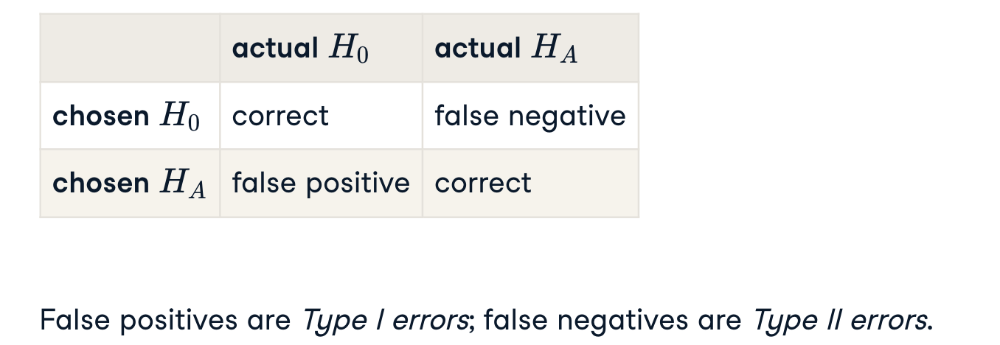

# Hypothesis Testing Fundamentals

## Hypothesis Tests in A/B Testing Use-cases

- **Example 1**:
  - In 2013, Electronic Arts, or EA, launched a video game called SimCity 5. Leading up to its release, they wanted to increase pre-order sales.
  - _Hypothesis_: "showing an ads would increase sales"
  - The **control** group: was shown the version with a banner advertising money off their next purchase with each pre-order. (with ads)
  - The **treatment** group: saw the version without the ad banner. (without ads)
  - EA compared the **percentage of checkouts** for the two groups to see which performed best.
  - Result:
    - The results of the A/B test were surprising.
    - The treatment page without the advertisement resulted in 43 percent higher sales than the control page with the advert.
    - The experiment proved that our intuition that "more discount adverts would result in more sales" was FALSE.

<p align="center"></p>

- **Example 2**: Stack-overflow survey about Data Scientist Salaries
  - _Hypothesis_: "the mean annual compensation of the population of data scientists is 110,000 dollars"

## Type of Hypothesis Tests: One-tailed vs two-tailed tests

- Hypothesis tests are used to determine whether the sample statistic lies in the tails of the null distribution. However, the way that the alternative hypothesis is phrased affects which tail(s) we are interested in.

<p align="center"></p>

<p align="center"></p>

## p-value

- `p-value` measure the strength of support for the null hypothesis
  - _Large p-values_ mean our statistic is producing a result that is likely not in a tail of our null distribution, and chance could be a good explanation for the result.
  - _Small p-values_ mean our statistic is producing a result likely in the tail of our null distribution.
  - Because p-values are probabilities, they are always between zero and one.
  <p align="center"></p>

### How to calculate p-value

- Step 1: calculate the z-score
- Step 2: pass the z-score to the standard normal CDF, norm-dot-cdf,; from scipy-dot-stats with the default values of mean zero and standard deviation of one.

 <p align="center"></p>
  <p align="center"></p>

- Example:
  - The null hypothesis, $H_0$, is that the proportion of late shipments is six percent.
  - The alternative hypothesis, $H_A$, is that the proportion of late shipments is greater than six percent.
  - The observed sample statistic, `late_prop_samp`, the hypothesized value, `late_prop_hyp` (6%), and the bootstrap standard error, `std_error` are available.

```Python
from scipy.stats import norm
# Calculate the z-score of late_prop_samp
sample_mean = np.mean(late_prop_samp) # population mean = late_prop_hyp
z_score = (sample_mean - late_prop_hyp) / std_error

# Calculate the p-value: right tail
p_value = 1 - norm.cdf(z_score, loc=0, scale=1)

# Print the p-value
print(p_value)
```

## Statistical Significance

### Significance Level

<p align="center"></p>

## Type of Errors

- For hypothesis tests and for criminal trials, there are two states of truth and two possible outcomes. Two combinations are correct test outcomes (true positive and true negative), and there are two ways it can go wrong.
- The errors are known as **false positives** (or "type I errors"), and **false negatives** (or "type II errors").

<p align="center"></p>
