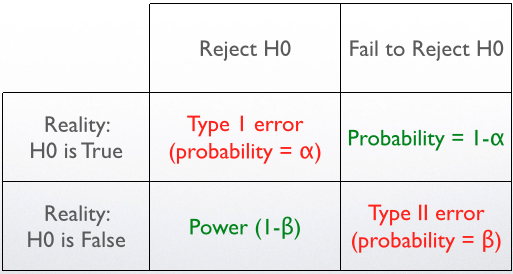

# Important Concepts

## Inferential Statistical Test

- When you conduct an inferential statistical test, you are often comparing two hypotheses:
  - `Null hypothesis` this hypothesis predicts that the program/treatment will not have an effect on your variable of interest.
    - For example, if you are measuring students’ level of concern for the environment before and after a field trip, the null hypothesis is that their level of concern will remain the same.
  - `Alternative hypothesis` This hypothesis predicts that you will find a difference between groups.
    - Using the example above, the alternative hypothesis is that students’ post-trip level of concern for the environment will differ from their pre-trip level of concern.
- Statistical tests look for evidence that you can reject the null hypothesis and conclude that the program/treatment had an effect.
- Example of inferential statistics: independent t-test, paired t-test, ANOVA, regression, etc.

### Error Types

<p align="center"></p>

- `Type I Error`: With any statistical test, however, there is always the possibility that you will find a difference between groups when one does not actually exist.
- `Type II Error`: when a difference does exist, but the test will not be able to identify it.

### Statistical Significance

- There is always some likelihood that the changes you observe in your participants’ knowledge, attitudes, and behaviors are due to chance rather than to the program/treatment.
- Testing for **statistical significance** helps you learn how likely it is that these changes occurred randomly and do not represent differences due to the program/treatment.
- To learn whether the **difference is statistically significant**, you will have to compare the probability number you get from your test (the p-value) to the critical probability value you determined ahead of time (the alpha level).
  - If the p-value is less than the alpha value, you can conclude that the difference you observed is statistically significant.

#### p-value

- `p-value`: the probability that the results were due to chance and not based on your program/treatment.
- p-values range from 0 to 1.
- :star: The lower the p-value, the more likely it is that a difference occurred as a result of your program/treatment.

#### Alpha level

- Alpha ($\alpha$) level: the error rate that you are willing to accept.
- Alpha is often set at 0.05 or 0.01.
  - :star: An alpha of 0.05 means that you are willing to accept that there is a 5% chance that your results are due to chance rather than to your program/treatment.
- The alpha level is also known as the **Type I Error** rate.

## Power Analysis

- [Reference](https://meera.seas.umich.edu/power-analysis-statistical-significance-effect-size.html)
- If you plan to use inferential statistics (e.g., t-tests, ANOVA, etc.) to analyze your evaluation results, you should first conduct a **Power Analysis** to determine _what size sample_ you will need.

### Power

- `Power` refers to the probability that your test will find a **statistically significant difference** when such a difference actually exists.
- In other words, Power = the probability that you will reject the null hypothesis when you should (and thus avoid a Type II error).
- It is generally accepted that power should be 0.8 or greater
  - `power=0.8` meaning that there is an 80% chance of finding a _statistically significant difference_ when there is one.

### Effect Size

- When a difference is statistically significant, it does not necessarily mean that it is big.
  - It simply means you can be confident that there is a difference.
- For example, evaluate the effect of an extra-cirriculum activity on student knowledge using pre and post-tests.
  - The mean score on the pre-test was 83 out of 100 while the mean score on the posttest was 84.
  - Although you find that the difference in scores is statistically significant (because of a large sample size), the difference is very slight, suggesting that the activity did not lead to a meaningful increase in student knowledge.
- :star: To know if an observed **difference** is not only **statistically significant** but also important or **meaningful**, you will _need to calculate its effect size_.
- For the power analysis, we can use this general guide developed by Cohen:
  - `< 0.1` = trivial effect
  - `0.1 - 0.3` = small effect
  - `0.3 - 0.5` = moderate effect
  - `> 0.5` = large difference effect
  - Note: common practice is to use a value of 0.5 as it indicates a moderate to large difference.

#### [Extra] How to calculate the effect size

- Effect size is calculated by taking the difference between the two groups (e.g., the mean of treatment group minus the mean of the control group) and dividing it by the standard deviation of one of the groups. For example, in an evaluation with a treatment group and control group, effect size is the difference in means between the two groups divided by the standard deviation of the control group.

### How to perform power analysis to determine the sample size

- To ensure that your sample size is big enough, you will need to conduct a power analysis calculation.
- Generally speaking, as your sample size increases, so does the power of your test.
  - This should intuitively make sense as a larger sample means that you have collected more information -- which makes it easier to correctly reject the null hypothesis when you should.

```Python
from statsmodels.stats.power import TTestIndPower

# Parameter for the power analysis
effect = 0.5 # effect size must be positive
alpha = 0.05 # significant level
power = 0.8 # there is an 80% chance of finding a statistically significant difference when there is one.

# Perform power analysis for T-test
pwr = TTestIndPower()

required_sample_size = pwr.solve_power(effect, power = power, nobs1= None, ratio = 1, alpha=alpha)
```
