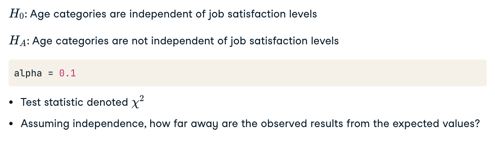
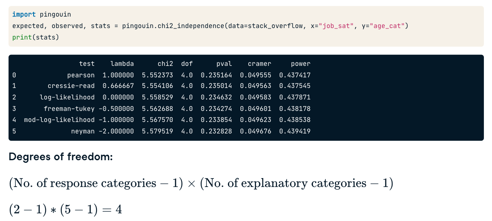

# Chi-square

## Chi-square test of independence

- The chi-square test of independence evaluates whether **two categorical variables** are independent. It is commonly used in contingency tables where the frequencies of different categories are compared.

### Chi-Square Distribution

- The Chi-Square Distribution
  The chi-square distribution is a theoretical distribution that is used to determine the critical value for the test. The shape of the chi-square distribution depends on the degrees of freedom, which is related to the number of categories being compared.

### How Many Tails for Chi-Square Tests?

- Chi-square tests are typically **one-tailed** tests (almost right-tailed) because we are usually interested in whether the observed frequencies deviate significantly from the expected frequencies in one direction.

### Example

#### Example 1:

- The null hypothesis is that independence occurs.
- The test statistic is denoted chi-square.
  - It quantifies how far away the observed results are from the expected values if independence was true.

<p align="center"></p>

<p align="center"></p>

#### Example 2:

```Python
import pandas as pd
from scipy.stats import chi2_contingency

# Contingency table
data = [[10, 20, 30], [6, 9, 17]]
table = pd.DataFrame(data)

stat, p_value, dof, expected = chi2_contingency(table)
print(f'Statistic: {stat}, p-value: {p_value}, dof: {dof}')
print(f'Expected frequencies: \n{expected}')
```

## Chi-Square Goodness of Fit Tests

- Chi-Square Goodness of Fit Tests
  The chi-square goodness of fit test checks whether an observed frequency distribution differs from a theoretical distribution. This test is useful when you want to see if your data fits a particular distribution, such as a normal distribution or a custom probability distribution.

- Visualizing Goodness of Fit
  Visualization helps to understand how well the observed data matches the expected distribution. Using bar charts or histograms can make this comparison more intuitive.

```Python
import numpy as np
from scipy.stats import chisquare

# Observed data
observed = np.array([10, 20, 30])
# Expected data
expected = np.array([15, 15, 30])

stat, p_value = chisquare(observed, expected)
print(f'Statistic: {stat}, p-value: {p_value}'
```
