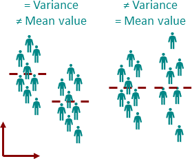

# Levene Test

- `Usages`: Levene Test to check whether the variances are **homogeneous**, i.e. whether there is equality of variance?
  - In order words, Levene test is used to test the Null hypothesis that the samples to be compared come from a population with the same variance.
- $H_0$: Groups have equal variance
- $H_1$: Groups have different variance
  - If the p-value for the Levene test is $>0.05$, then the variances are not significantly different from each other (i.e., the homogeneity assumption of the variance is met).
  - If the p-value for the Levene's test is $<0.05$, then there is a significant difference between the variances.
- :star: **Note**: stable against violations of the normal distribution.
<p align="center"><br>Example of "Different mean, same variance" & "Same mean, different variance"</p>

- There are 3 types of Levene’s statistics:
  - If a distribution has a **longer-tailed** distribution like the Cauchy distribution then we use a `trimmed mean`.
  - For **skewed** distribution, if the distribution is not clear we will use the `median` for test statistics.
  - For the **symmetric** distribution and moderately tailed distribution, we use `mean` value for distribution.

```Python
from scipy.stats import levene
# define groups
group_1 = [14, 34, 16, 43, 45,
		36, 42, 43, 16, 27]
group_2 = [34, 36, 44, 18, 42,
		39, 16, 35, 15, 33]

# define alpha
alpha = 0.05
# now we pass the groups and center value
# from the following
# ('trimmed mean', 'mean', 'median')
w_stats, p_value = levene(group_1, group_2,
						center='mean')

if p_value > alpha:
	print("We do not reject the null hypothesis")
else:
	print("Reject the Null Hypothesis")
```
