# t-test

## t-distribution

- The test statistic, t, follows a t-distribution. t-distributions have a parameter called the **degrees of freedom**, or df for short.
- As we increase the degrees of freedom, the t-distribution gets closer to the normal distribution. In fact, a normal distribution is a t-distribution with infinite degrees of freedom.

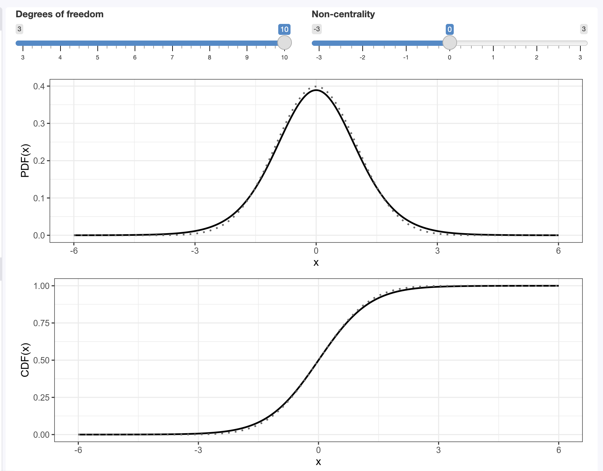

### DoF calculation

- Suppose our dataset has 5 independent observations, and that four of the values are 2, 6, 8, and 5. Suppose we also know the sample mean is 5. With this knowledge, the fifth value is no longer independent.
- In our two sample case, there are as many degrees of freedom as observations (number of childs $n_{child}$ + number of aldult $n_{adult}$), minus 2 because we know two sample statistics, the means for each group.

## Assumptions of the t-test

- The t-test relies on certain assumptions to provide valid results:
  - **Normality of the Data**: The t-test assumes that the data in each group are approximately normally distributed. This is especially important when dealing with small sample sizes. If the data are not normally distributed, the t-test results may be unreliable.
  - **Homogeneity of Variances**: For an independent two-sample t-test, the variances of the two groups being compared are assumed to be equal. This assumption ensures that the t-test correctly accounts for variability within each group. If the variances are not equal, it can affect the accuracy of the test.
  - **Independence of Observations**: The observations within each group should be independent. This means that the value of one observation should not influence or be related to the value of another observation. Violation of this assumption can lead to incorrect conclusions.

## Two-sample t-test

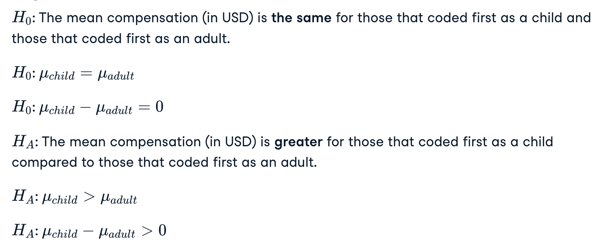

- In the two sample case, the test statistic, denoted `t`, uses a similar equation as z-score (z-scores are calculated by taking the sample statistic, subtracting the mean of this statistic as the population parameter of interest, then dividing by the standard error).
- We take the difference between the sample statistics for the two groups, subtract the population difference between the two groups, then divide by the standard error.

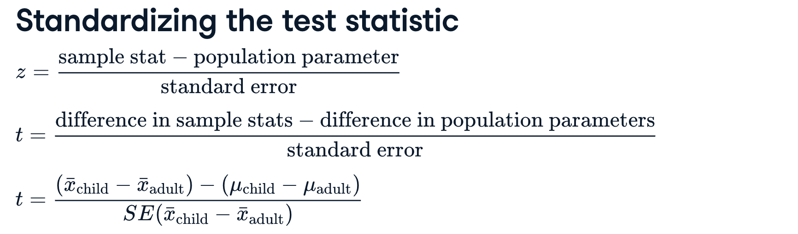

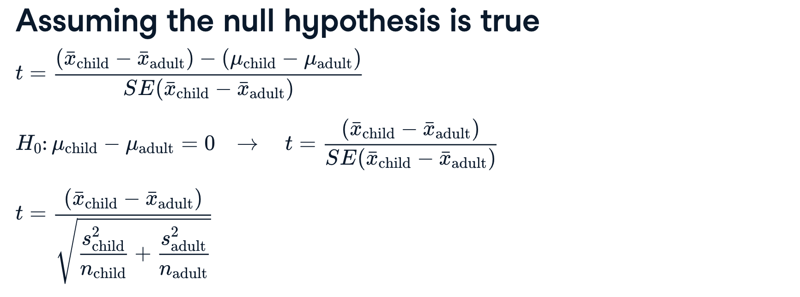

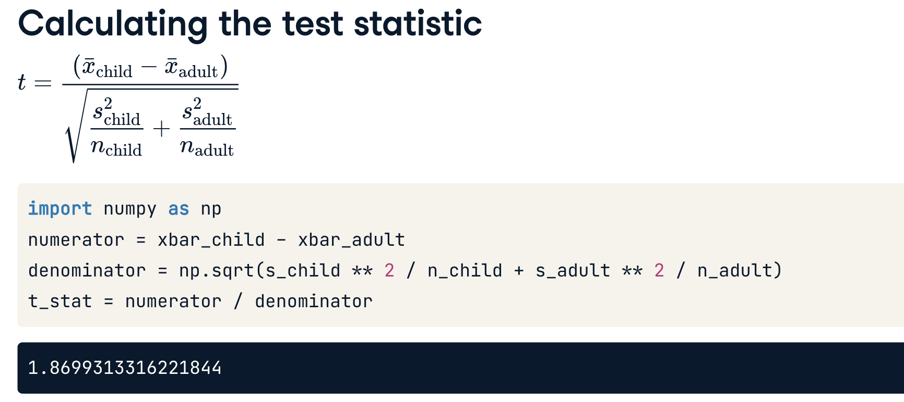

- Degree of freedom minus 2 because we know the 2 sample means of the population.

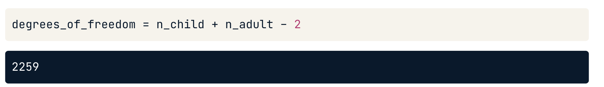

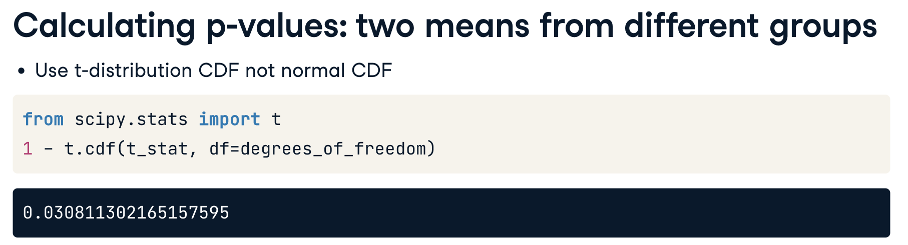

## Paired t-test

- For paired analyses, rather than considering the two variables separately, we can consider a single variable of the difference.

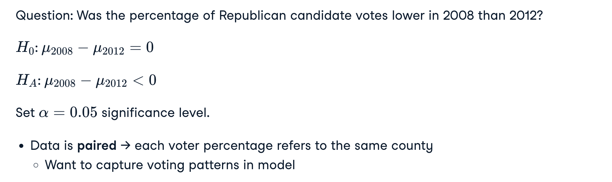

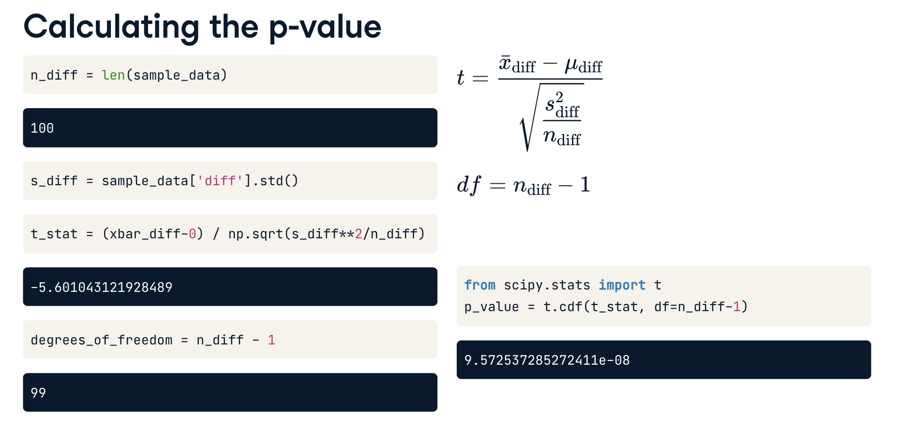

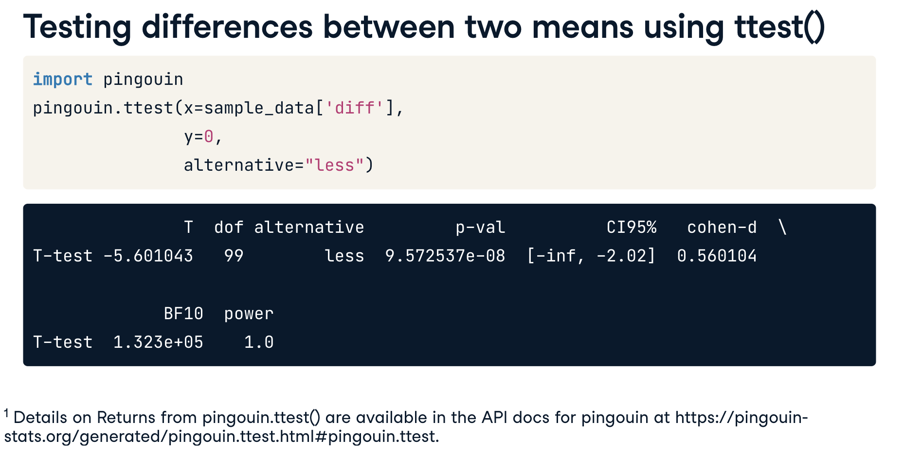

- For a converted one sample test like this, y specifies the hypothesized difference value from the null hypothesis, which is zero (y=0).

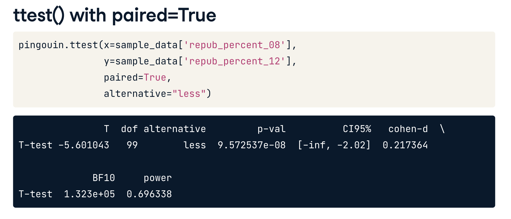

